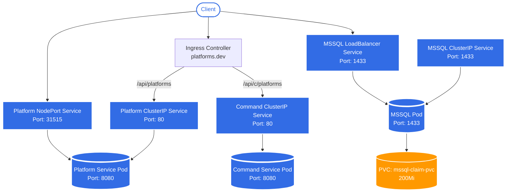

```mermaid
graph TD
    %% External Access
    Client([Client])
    
    %% Ingress
    ingress[Ingress Controller\nplatforms.dev]
    
    %% Services
    platformNP[Platform NodePort Service\nPort: 31515]
    platformCIP[Platform ClusterIP Service\nPort: 80]
    commandCIP[Command ClusterIP Service\nPort: 80]
    sqlCIP[MSSQL ClusterIP Service\nPort: 1433]
    sqlLB[MSSQL LoadBalancer Service\nPort: 1433]

    %% Deployments/Pods
    platformPod[(Platform Service Pod\nPort: 8080)]
    commandPod[(Command Service Pod\nPort: 8080)]
    sqlPod[(MSSQL Pod\nPort: 1433)]

    %% Storage
    pvc[(PVC: mssql-claim-pvc\n200Mi)]

    %% Connections
    Client --> ingress
    Client --> platformNP
    Client --> sqlLB
    
    ingress -->|/api/platforms| platformCIP
    ingress -->|/api/c/platforms| commandCIP
    
    platformCIP --> platformPod
    commandCIP --> commandPod
    sqlCIP --> sqlPod
    sqlLB --> sqlPod
    platformNP --> platformPod
    
    sqlPod --> pvc

    %% Styling
    classDef service fill:#326ce5,stroke:#fff,stroke-width:2px,color:#fff
    classDef pod fill:#326ce5,stroke:#fff,stroke-width:4px,color:#fff
    classDef storage fill:#ff9900,stroke:#fff,stroke-width:2px,color:#fff
    classDef client fill:#fff,stroke:#326ce5,stroke-width:2px,color:#326ce5

    class platformNP,platformCIP,commandCIP,sqlCIP,sqlLB service
    class platformPod,commandPod,sqlPod pod
    class pvc storage
    class Client client

```